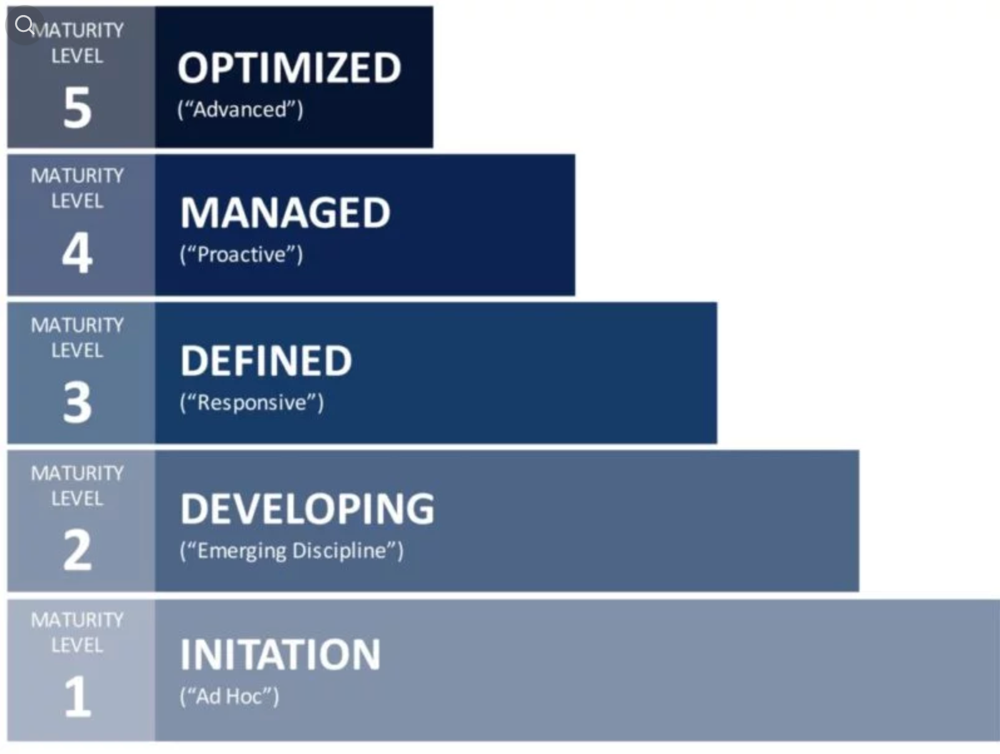

## Increasing design system quality and adoption by proper stakeholder management
{#cover}

<Cover src="pictures/round-dance.jpg" alt=""/>

[Varya Stepanova](https://varya.me) @ Smartly DevTalks 2021

<!--
Annotation

I will tell about stakeholder management when building and maintaining design systems.
Through the whole design system workflow, its team communicates to the people across
the whole company: designers and developers, product managers, and business people.
Let's see how do we, the design system techies, might make these people happy.
-->

## Me
{ .no-title .about-me }

{ .photo }

### Varya Stepanova
<b>Design Systems Architect</b> 
<small>engineering manager, frontend architect, independent consultant</small>

#### Contacts

  <a href="https://www.linkedin.com/in/varyastepanova/">linkedin.com/in/varyastepanova</a>
   
  <a href="http://varya.me">varya.me</a>
   
  <a href="https://twitter.com/varya_en">@varya_en</a>

<!--

My name is Varya. I work as an independent consultant, and design systems are my
major focus. I started with libraries of components about 10 years ago,
before the term "design systems" even emerged.

By that time, my own understanding and the community's was more technical.
We were paying a lot of attention to how to code the components,
how to document them.

Slightly by today, I changed my focus to more process and people oriented.
I realised that the biggest obstacle on the way is the gap between specialists:
designers and developers, product people and business people. In the meanwhile
I got a design education that helped me to see the picture at scale.

Nowadays, even though I am still doing a lot of hands-on and architectural frontend
work related to the design systems, I shift to engineering&project management, educating,
and enganging people.

-->

## Design Systems are for people

<iframe width="560" height="315" src="https://www.youtube.com/embed/xlxqbf4s8Tk" frameBorder="0" allow="accelerometer; autoplay; clipboard-write; encrypted-media; gyroscope; picture-in-picture" allowFullScreen></iframe>

Also available in a [text version](https://publication.design.systems/design-systems-are-for-people-a484620b6988)

<!--
To start with the topic, I would like first refer to many other talks,
articles and blog posts that highlight the "people" aspect of design systems.

I strongly relate it.
-->

## Why? What? How? For whom?
{ .no-title }

<Blockquote style={{ marginTop: '2em'}} caption={
  <>
    Magera Moon,&nbsp;
    <a href="https://publication.design.systems/design-systems-are-for-people-a484620b6988">
      The people part of design systems
    </a>
  </>
}>
Making design systems successful is just as much about creating a people system as it is about creating a technical or operational one.
</Blockquote>

<Blockquote style={{ marginTop: '2em'}} className="next" caption={
  <>
    Ryan DeBeasi,&nbsp;
    <a href="https://www.smashingmagazine.com/2019/10/design-systems-relationships/">
      Design Systems Are About Relationships
    </a>
  </>
}>
To build a design system, don’t start by writing code and choosing tools; <b>start by talking to the people who will use the system</b>. Learn about their needs and constraints, and help them solve problems.
</Blockquote>

## To boost a&nbsp;design system {.shout .shout--small .shout--highlighted }

## focus on people {.shout .shrink}

## But... how? {.shout}
{.but-how}

## What does design system team do?
{ .slide--shout .slide--primary }

## What does design system team REALLY  do? {.shout}
{ .really }

## Design system work
{ .work }

{ .triangle }
**User-centered design system resources** 
*Lyft Design Systems Team @ Schema 2021* 
[https://youtu.be/Pqm8LkB44gU](https://youtu.be/Pqm8LkB44gU)

## Design system work
{ .work2 }

{ .image }

### 1. The product part
{ .first-header }

### 2. Everything else

## The product

- UI kit
- React Library
- Web Components Library
- Design tokens package

## In and out
{ .in-and-out }

<Columns col="2">

- Bug reports { .in }
- Feedback & suggestions
- Questions and help requests

- Releases
- Incident warnings
- Announces

</Columns>

## Channels of Communication

- Design system website
- Slack/Flowdock/Teams
- GitHub
- Design & development forums

## Clear picture of the system
{ .slide--shout .slide--highlighted }

## What is available?
{ .no-title }

### What component is available what is not?

### What components are soon coming?

### What is current status of a component?

{ .next }

## Expectations
{ .no-title .slide--shout }

<Blockquote caption="Raphael Malveau and Thomas J. Mowbray, Ph.D.">
Expectation management is one of the most powerful weapons in psychological warfare.
</Blockquote>

## Component status map
{ .component-status-map }

{ .status-map-image }

Idea from ["Design System Features, Step-by-Step" by Nathan Curtis](https://medium.com/eightshapes-llc/system-features-step-by-step-e69c90982630)

See in action at [Polaris design system](https://polaris.shopify.com/components/component-status#navigation)

## Status on the component page

Where in the flow is it? research/design/development/testing

What platforms is it available for? (e.g [Card @ Orbit](https://orbit.kiwi/components/structure/card/#component-status))

Is it deprectaed? (e.g. [Theme Swicth @ Wanda](https://design.wonderflow.ai/components/other/theme-switch/))

What is coming? (e.g. [Avatar @ Lightning](https://www.lightningdesignsystem.com/components/avatar/))

## Communication about the process
{ .slide--shout .slide--primary }

## Open backlog policy
{ .backlog-policy }

{ .image }

## What do we get?

- Open process and clear message about resources
- Ready contribution requests
- Knowledge of who is interested in a component

## Linking to the people
{ .slide--shout .slide--primary-light }

## Where components are used?
{ .where-used }

{ .image }

Example link: http://bit.ly/ds-matrix-example

## Who is using components?
{ .who-is-using }

{ .image }

## Tools for stakeholder management

- Excel / Google Sheets
- Google DataStuido
- Own solutions

## Address to certain people personally

* Library has critical updates in particular components
* Ask for feedback about upcoming changes
* Someone is not using the component. Why?
* Design system team is searching for contributors
* Team search for other teams using the same component

## How to meet new people?
{ .slide--shout .slide--highlighted }

## Onboarding sessions
{ .onboarding-sessions }

{ .image }

*e.g.* **every 1st Wednesday of the month**

- for designers
- for developers
- for project owners

## How to go with innovations?
{ .slide--shout .slide--primary }

## Proof of Concept / MVP
{ .slide--shout }

## Feedback
{ .no-title }

<Cover src="pictures/feedback.jpeg" alt=""/>

## How to get feedback

Explain why it is needed

Use all the possible public forums

Ask people personally and tell the how they would benefit

Organize try-on session 

## Design system is product
{ .slide--shout .slide--primary-light }

## Look around

### What do other design systems do?

- Branding
- Shared ownership: contribution guidelines, mentioning contributors, links to editing
- Positions in DS team
- Flows and trees

### Continue with benchmarking
{ .next }

## Up to the business levels
{ .slide--shout .slide--highlighted }

## Business value of design system
{ .business-value }

<Cover src="pictures/money.jpg" alt=""/>

- Faster design and development
- Fewer costs
- "Time to market" decreased
- Doing "real work"

## Getting mature
{ .getting-mature }

⬅

{ .image }

## Stakeholder management is  one of the design system's processes
{ .slide--shout }

## Invest time {.shout .shrink}

## Get structured {.shout}

## Manage {.shout}
{.but-how}

## Thank you
{ .thanks }

{ .photo }

#### [Slides: varya.me/devtalks-2021/](https://varya.me/devtalks-2021/)

#### by Varya Stepanova

  <a href="https://www.linkedin.com/in/varyastepanova/">linkedin.com/in/varyastepanova</a>
   
  <a href="http://varya.me">varya.me</a>
   
  <a href="https://twitter.com/varya_en">@varya_en</a>

